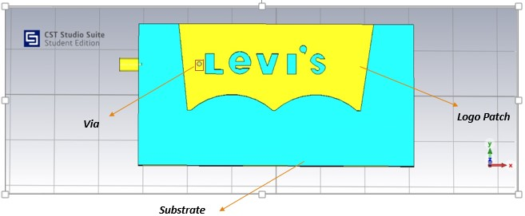
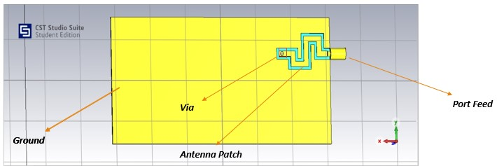
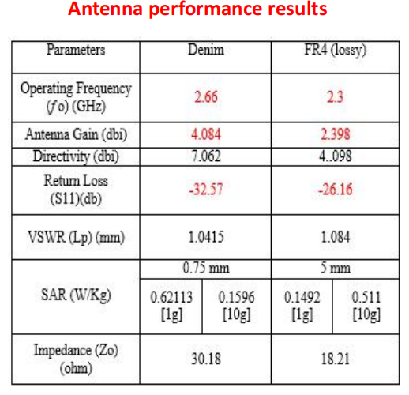
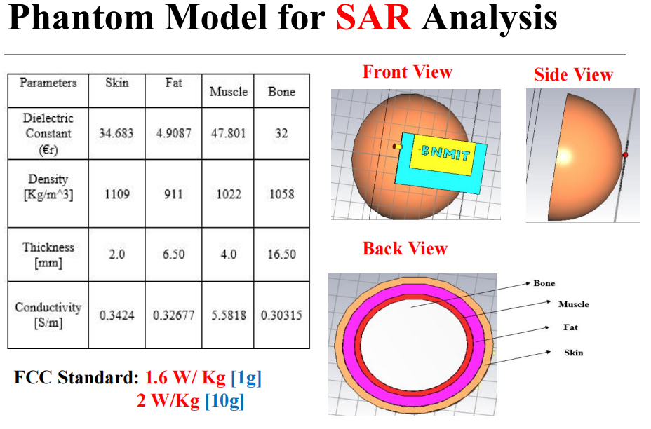
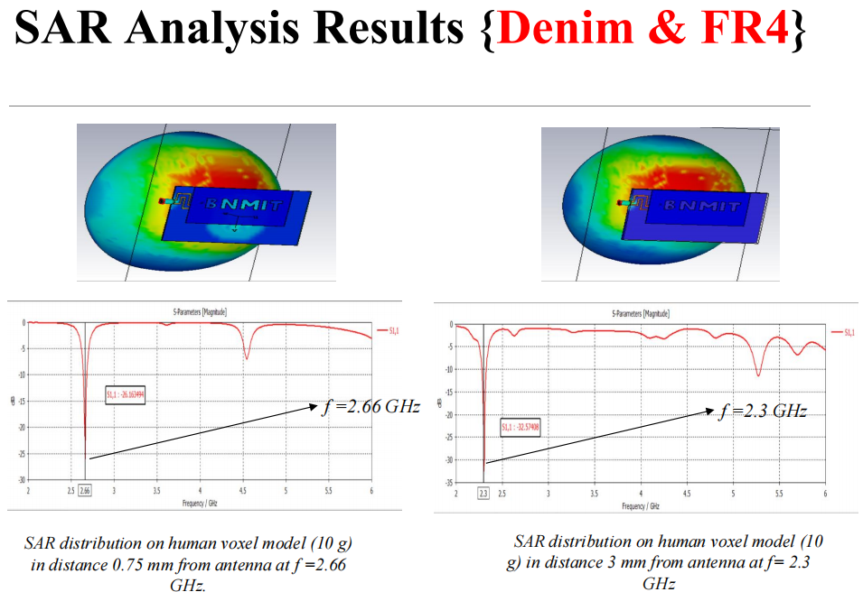
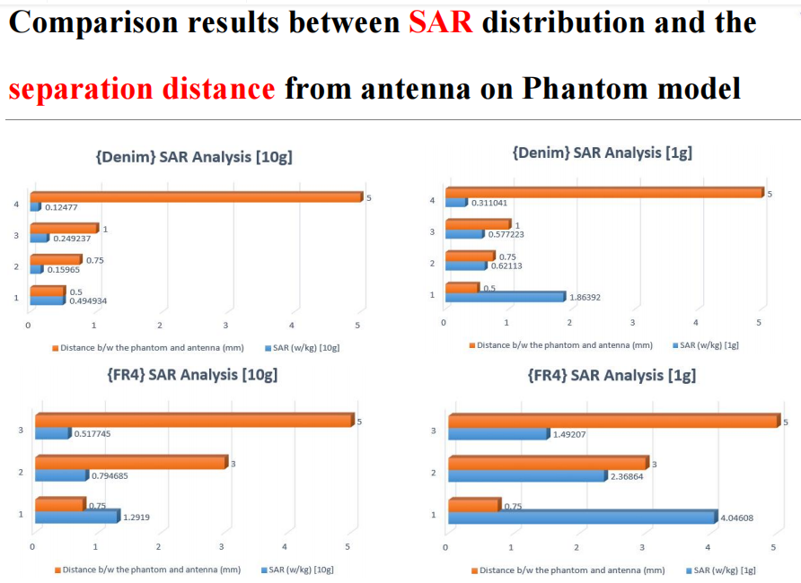

<!-- Badges: -->

# Werable_Antenna

<!-- Logo: -->

  

- **Organization**
  - [B N M Institute of Technology (BNMIT)](https://www.bnmit.org/)
- **Student**
  - [Shisheer S Kaushik](https://shisheerkaushik.netlify.app/)
- **Mentors**
  - [Dr. Rekha P](https://www.bnmit.org/electronics-communication-engineering/faculties-ece/dr-rekha-p/), [Prof. Suamthi A](https://www.bnmit.org/electronics-communication-engineering/faculties-ece/sumathi-a/)
- **Project Details**
  - [Accepted Proposal](https://raw.githubusercontent.com/ShisheerKaushik24/Certificate-Acheived/blob/master/event/iitcee-2023-conference/Program-final-iitcee-schedule.pdf)

### Introduction

Remote health monitoring of elderly people is a serious issue of concern. Such an issue can be evaded by using wearable antennas which can get completely integrated onto clothes and use it for remotely transmitting/receiving the sensor data without affecting the elderly’s regular habits. This research work aims to study and understand real wearability of the antenna and investigate the challenges in the design and fabrication of highly efficient antenna which can be fabricated on a fully flexible fabric substrate or a solid substrate. 

The front view of the antenna

The back view of the antenna

A wearable microstrip patch antenna with operating frequencies of **2.3 GHz (FR4 as substrate) and 2.66 GHz (Denim material as substrate)** is designed and tested. Prominent materials considered for substrate parts are Denim fabrics with the relative permittivity **€r = 1.67**, and the loss tangent tan **δ = 0.085** and FR4 (lossy) with the dielectric constant **€r = 4.3**, and loss tangent tan **δ = 0.025** material, while conventional copper metal sheets have been used as antenna conductive material. 

The antenna performance outcomes

The antenna proposed is designed and simulated using `CST studio simulator`, fabricated using flexible copper sheet and tested. 

Results demonstrate that the designed antenna is very efficient,  highly sensitive and of low-cost with performance meeting the expectation of the application in need. Further, proposed wearable antenna may also be attached to human body directly 
to sense suitable parameters.

### Conclusion

The research work demonstrates design of antennas that are made of textile and solid substrate materials which are suitable for wearable applications like remote monitoring of elderly people integrated with sensors. This article presents the design and fabrication of a wearable, fully flexible and efficient microstrip patch antenna pasted on both jeans textile and FR4 (lossy) material to operate at f = 2.66 GHz and f = 2.3 GHz as a centre frequencies. 

This work discusses, experimental and numerical results of the antenna designed and fabricated. It is observed that the SAR value, which is an important parameter is very low and has increased slightly by using FR4 (lossy) material. 

Results demonstrate that the presented wearable antenna fabrication design is very efficient , highly sensitive and low-cost with tailored performance for the intended application at hand. Since, the front end design of the antenna is a customized logo, a design, first of its kind, comparative analysis of obtained results with the existing results was not possible.

# License

This work is licensed under a [MIT License](LICENSE) license.

Created and maintained by [@Shisheer S Kaushik][1].

[1]: https://github.com/ShisheerKauhik24

